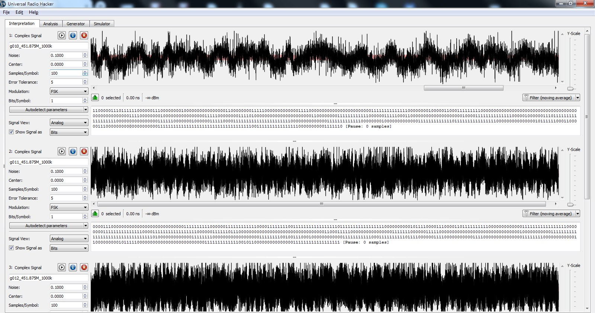
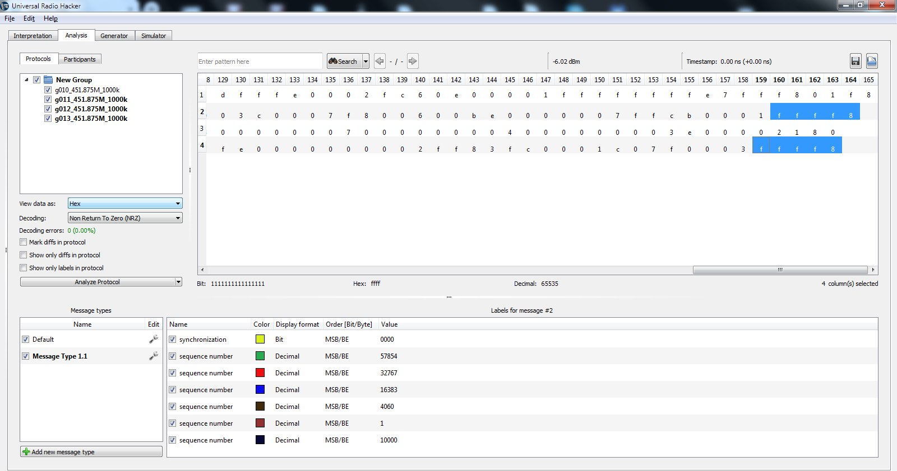
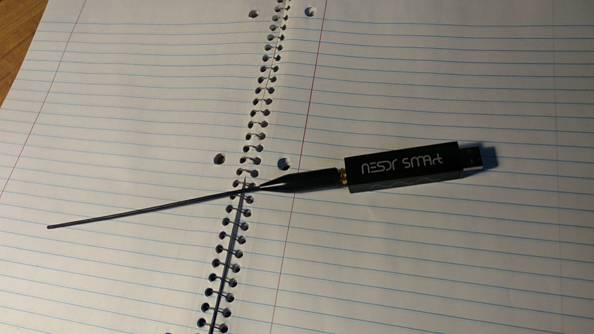
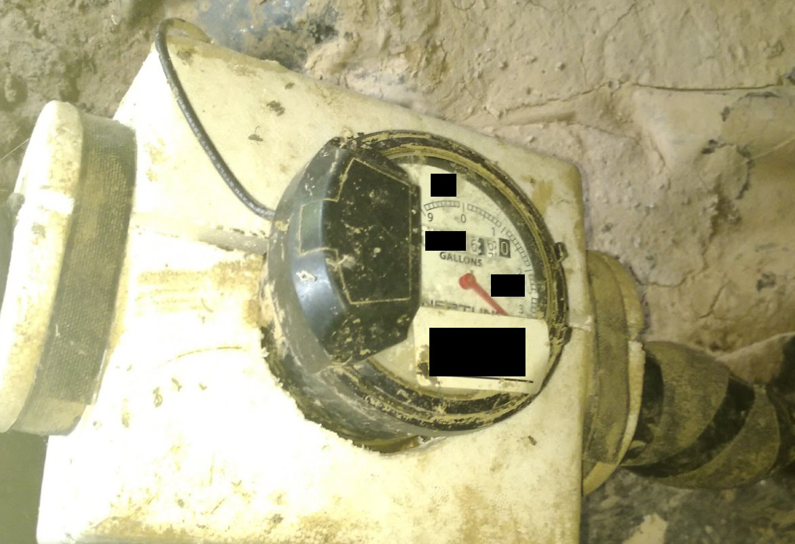
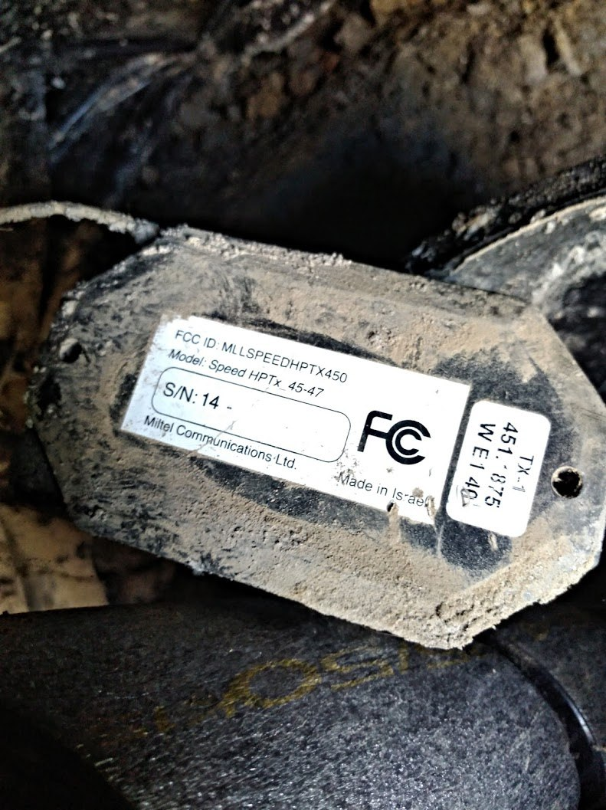
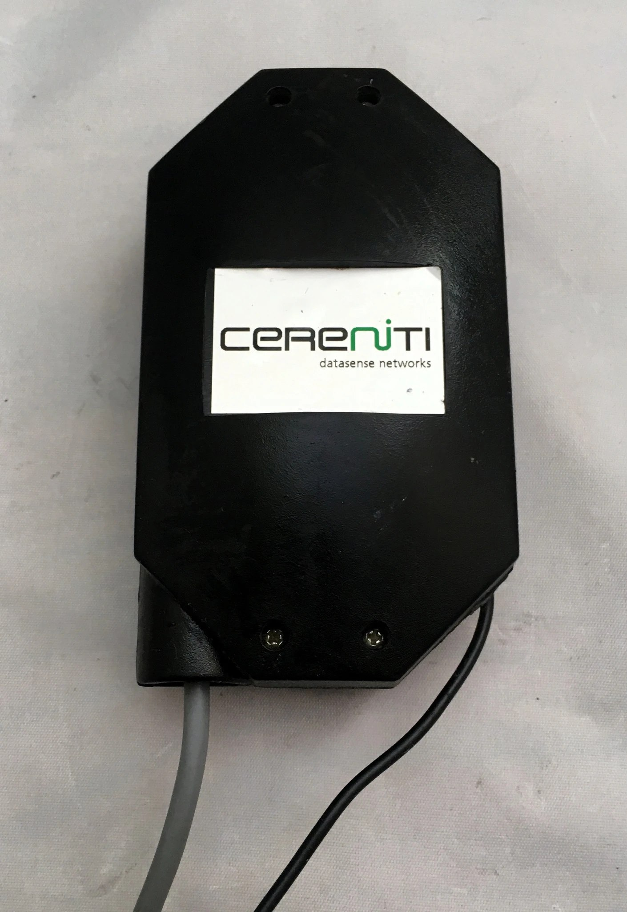

## rtlsdr-test1 - Catching a pulse signal from a water meter transmitter using RTL-SDR

My first test of RTL-SDR to read signals from a water meter transmitter

This is supposed to be a follow-up to my [Reddit post](https://www.reddit.com/r/RTLSDR/comments/iajgbi/how_to_catch_a_short_and_potentially_very/) in r/RTLSDR sub


### Some links for the context:
* Data provided by the manufacturer to FCC - https://fccid.io/MLLSPEEDHPTX450
* Documentation for the transmitter - https://fccid.io/MLLSPEEDHPTX450/User-Manual/users-manual-239801


### Process

Based on the advice I got in multiple comments to my Reddit post, I tried using rtl_433 to capture some signals.

It quickly turned out that running `rtl_433 -f 451.875M -s 1024k` does not produce any results at all as rtl_433 is trying to decode a signal on the fly and does not show anything if it is not of one of the known types.

Eventually I ended up with `rtl_433 -f 451.875M -s 1000k -A -R 0 -S all -T 3600` command, where (as per https://github.com/merbanan/rtl_433 Usage Examples): 

`-A` stands for pulse analyzer

`-R 0` for disabling decoders 

`-S all` for saving all recorded signals 

`-T 3600` for shutting down after 3600 seconds (1 hour)

### Some interim results

As a result I got some recordings, however it is still unclear if those are useful signals or just noise:

```
*** Saving signal to file g012_451.875M_1000k.cu8 (42779 samples, 131072 bytes)
Detected OOK package    2020-08-16 01:55:16
Analyzing pulses...
Total count:    1,  width: 0.02 ms              (   19 S)
Pulse width distribution:
 [ 0] count:    1,  width:   19 us [19;19]      (  19 S)
Gap width distribution:
Pulse period distribution:
Level estimates [high, low]:  15135,   6227
RSSI: -0.3 dB SNR: 3.9 dB Noise: -4.2 dB
Frequency offsets [F1, F2]:    2365,      0     (+36.1 kHz, +0.0 kHz)
Guessing modulation: Single pulse detected. Probably Frequency Shift Keying or just noise...
```

I put some of those signals into [signals folder](signals) in the repo, as well as the [full log](logs) for more information.

### First attempt at analyzing the signal _(not too successful)_

I tried opening the signal files in [Universal Radio Hacker](https://github.com/jopohl/urh), but it looks like it is above my abilities at this point without digging deeper into how URH works. 

This is my Interpretation screen in URH with several of files recorded by `rtl_433` loaded into it:



I tried playing around with some of the parameters (e.g. Noise and Error Tolerance) to produce some demodulated/decoded signal that I can look at in Analysis, though I have to admit, at this point I am already __well past the point of knowing what I am doing__ :fearful:



I can see some of the patterns (like similar part `f8` in the end of most messages), but so far I can't make sense of any of the data at all.

### Appendix: Equipment and how the meter / transmitter looks

#### RTL-SDR

I am using a [Nooelec NESDR Smart](https://www.nooelec.com/store/nesdr-smart.html) dongle with a short antenna from one of my Yaesu transcievers (no specific reason over stock antenna, just easier to play around with; I may try other antennas I have later)



#### Water meter and transmitter

My water meter is installed in quite a hard-to-access spot underneath the house - it is quite an old Neptune meter that does not seem to support R900 protocol (or it would've been much easier to just use [rtlamr](https://github.com/bemasher/rtlamr) to pull data from it out of the box.



Miltel Communications transmitter is connected to the meter with a short ~2ft wire



I don't have a good picture of the other side of my transmitter, but it looks exactly as this stock picture online and says _"Cereniti datasense networks"_ 


